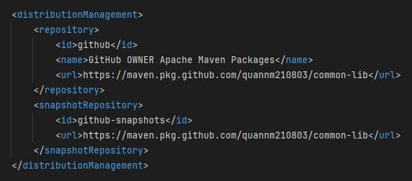
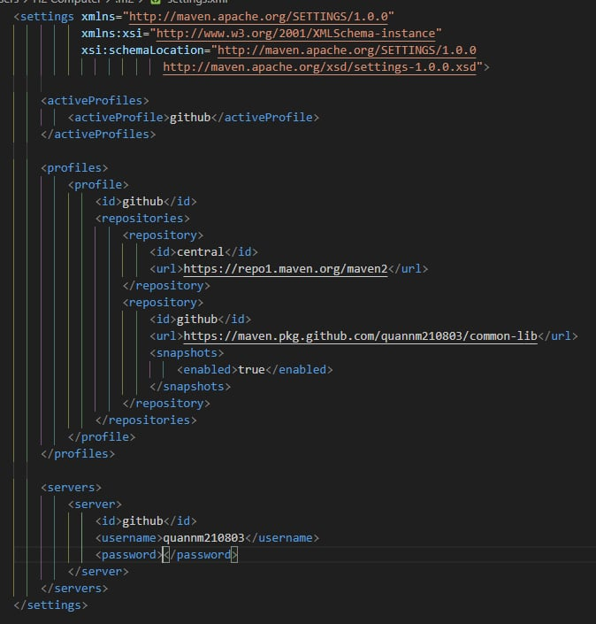

# COMMON-LIB

## 🚀 Getting Started

1. **Clone this repository**

   ```bash
   git clone https://github.com/QuanNM210803/common-lib.git
   ```

2. **Create your github package**

   ```bash
   2.1. Create a new repository on GitHub.  
   2.2. Pom.xml file change to your github username.
   2.3. Add settings.xml file with your credentials to the folder C:\Users\YOUR-DEVICE\.m2.
   2.4. Find the commit containing the version you want to use, then checkout to that commit (example: version 1.0.0).
   2.5. Push to github package with maven: mvn clean deploy.
   ```

## Images
1. **pom.xml file**

  

2. **settings.xml file** 

